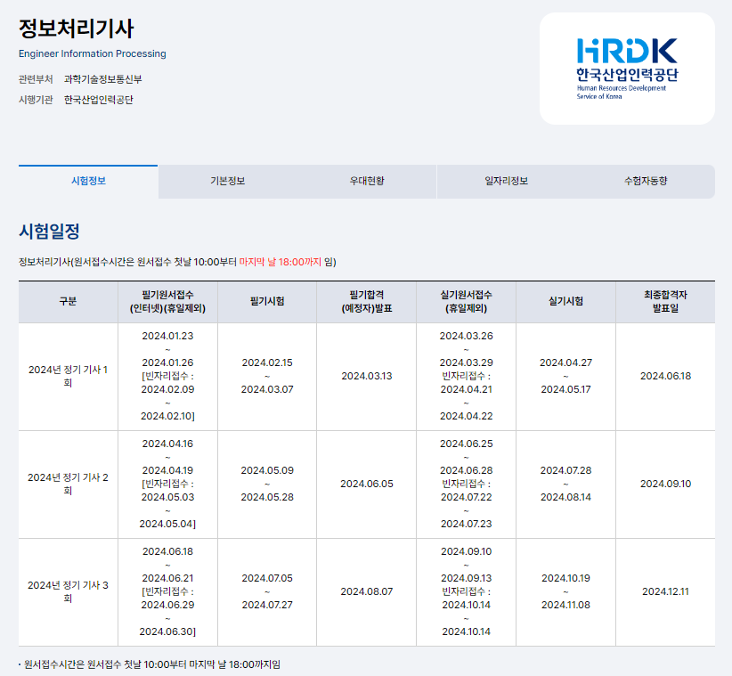

서버와 데이터를 주고받는 방법

서버란 데이터를 달라고 요청하면 데이터를 주는것을 통틀어 다 서버라고함

1.어떤 데이터인지 (url) 2.어떤 방법으로 요청할지 잘 기재해야함 (get/ post)

get은 데이터를 읽고싶을때
post는 데이터를 보내고싶을때

comic.naver.com을 get을 하면 웹툰을 주는것임

Api Documentation이란 해당 url을 불러오면 해줌

특정 URL로 GET요청하는방법은

URL입력하는곳이 Get요청 하는것임

POST 요청은 FORM 태그

POST요청은 데이터보내주기
유저데이터 DB에 저장하기
댓글같은경우는 POST

단 get과 post의 단점은 페이지가 새로고침이 된다는건데

ajax는 새로고침없이 get post 요청이 가능하다.

